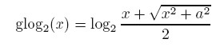
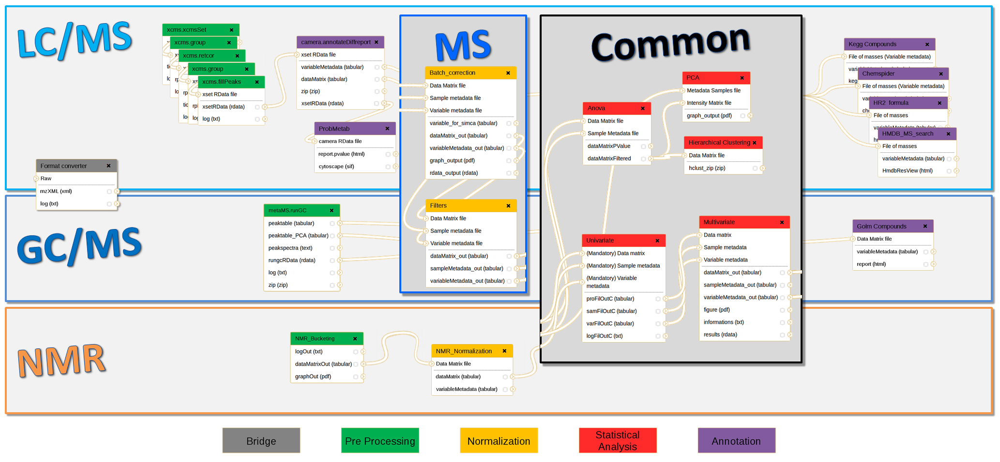
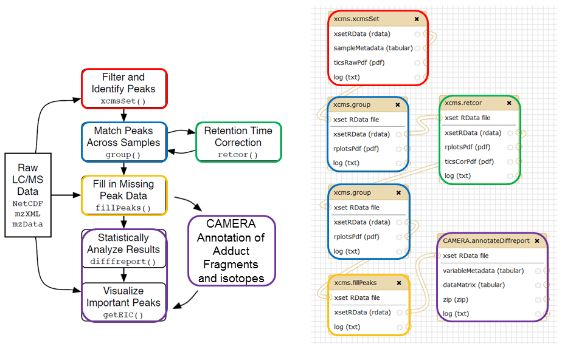
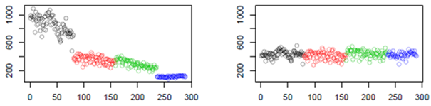
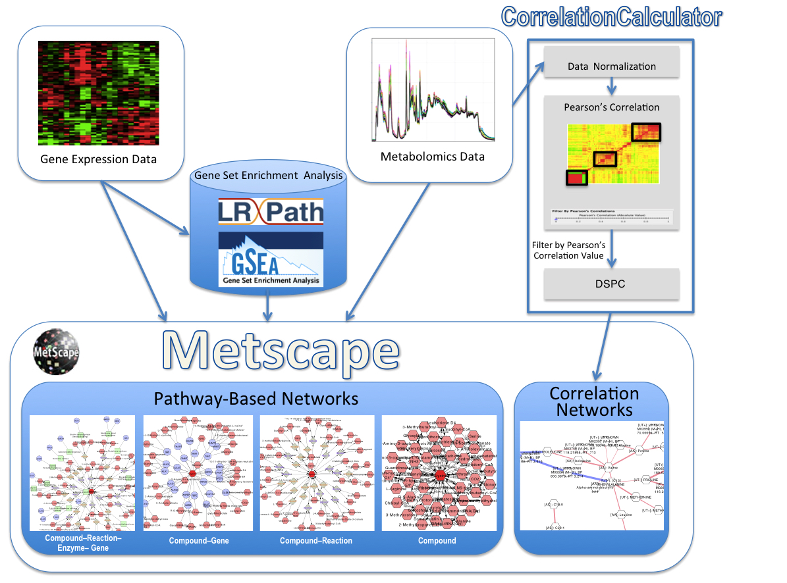
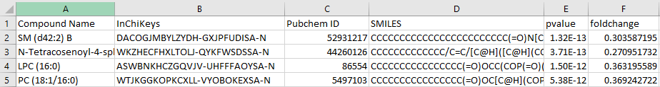
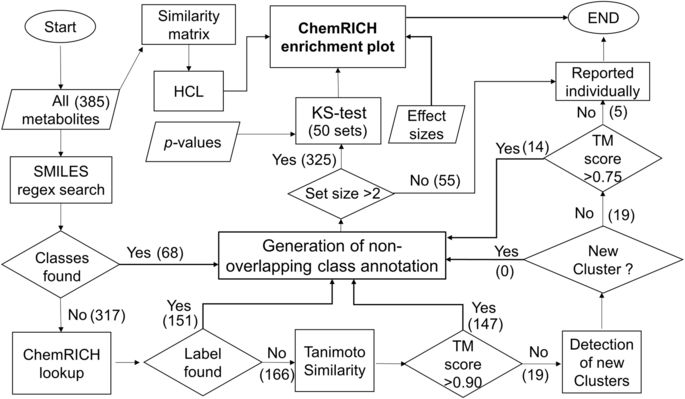

# Whole analysis softwares (top-down) 

## Metaboanalyst 

MetaboAnalyst is a web server designed to permit comprehensive metabolomic data analysis, visualization and interpretation [@Xia2015]. It supports a wide range of complex statistical calculations and high quality graphical rendering functions that require significant computational resources.

#### <u> Upload dataset </u>

MetaboAnalyst accepts data from either targeted profiling (concentration tables) or metabolic fingerprinting approaches (spectral bins, peak lists) produced from either NMR, LC-MS, or GC-MS. 

GC/LC-MS spectra saved as open data format (NetCDF, mzDATA, mzXML) can also be processed using the XCMS package [@Tautenhahn2012]. 

#### <u> Processing </u>

**1. Missing values:**

 + Remove features with too many missing values:
 
 By default, MetaboAnalyst remove all features in dataset that have > 50% of missing values. This parameter can be modified by user.

 + Impute values:
 
 MetaboAnalyst offers a variety of methods to deal with missing values [@Armitage2015]. By default, the missing values are treated as the result of **low signal intensity**. 
 
 They will be replaced by **half of the minimum positive values detected in your data**.
 
 _The assumption of this approach is that most missing values are caused by low abundance metabolites (i.e.below the detection limit)._
 
 Users can also specify other methods, such as replace by **mean**, **median**, **minimum**, **Probabilistic PCA (PPCA)**, **Bayesian PCA (BPCA)**, **Singular Value Decomposition (SVD)** or **k-nearest neighbour (KNN)**.
 
**2. Filtering:**

The purpose of the data filtering is to identify and remove variables that are unlikely to be of use when modeling the data. No phenotype information are used in the filtering process, so the result can be used with any downstream analysis. _This step is strongly recommended for **untargeted metabolomics** datasets (i.e. spectral binning data, peak lists) with large number of variables_, many of them are from baseline noises. Filtering can usually improve the results.

Non-informative variables can be characterized in three groups: 

  + _Variables of very small values_ (close to baseline or detection limit) - these variables can be detected using **mean or median**.
 
  + _Variables that are near-constant values_ throughout the experiment conditions (housekeeping or homeostasis) - these variables can be detected using **standard deviation (SD)**; or the robust estimate such as **interquantile range (IQR)** (default).
 
  + _Variables that show low repeatability_ - this can be measured using QC samples using the **relative standard deviation(RSD = SD/mean)**. Features with high percent RSD should be removed from the subsequent analysis (the suggested threshold is 20% for LC-MS and 30% for GC-MS). 
 
For data filtering based on the first two categories, the following empirical rules are applied during data filtering:

Less than 250 variables: 5% will be filtered;  
Between 250 - 500 variables: 10% will be filtered;  
Between 500 - 1000 variables: 25% will be filtered;  
Over 1000 variables: 40% will be filtered;  
 
Users can also use **Non-parametric relative standard deviation (MAD/median)** , **Median absolute deviation (MAD)** or non filtering (less than 5000 features).
 
#### <u> Normalization </u>

The normalization procedures are grouped into three categories. 

**1. Sample normalization:**

Normalization by a reference sample (probabilistic quotient normalization), is a robust method to account for different dilution effects of biofluids. This method is based on the calculation of a most probable dilution factor (median) by looking at the distribution of the quotients of the amplitudes of a test spectrum by those of a reference spectrum.

Methods:

  + Sample-specific normalization (i.e. weight, volume)  
  + Normalization by sum  
  + Normalization by median  
  + Normalization by reference sample (PQN)  
  + Normalization by a pooled sample from group  
  + Normalization by reference feature  
  + Quantile normalization  

**2. Data transformation:**

  + Log transformation	(generalized logarithm transformation or glog)  

Generalized logarithm (glog) is a simple variation of ordinary log in order to deal with zero or negative values in the data set.

```{r glog, echo=FALSE, out.width = '30%'}

```
where a is a constant with a default value of 1.  

  + Cube root transformation	(take cube root of data values)  

**3. Scaling:** [@VandenBerg2006]

  + Mean centering	(mean-centered only)    
  + Auto scaling	(mean-centered and divided by the standard deviation of each variable)    
  + Pareto scaling	(mean-centered and divided by the square root of standard deviation of each variable)  
  + Range scaling	(mean-centered and divided by the range of each variable)  

```{r scale, echo=FALSE, out.width = '85%'}
knitr::include_graphics("scaling.png")
```

#### <u> Statistics </u>

**Univariate Analysis**  

  + Fold Change Analysis (2 groups only)
  + T-tests (2 groups only)
  + Volcano plot (2 groups only)
  + One-way Analysis of Variance (ANOVA)
  + Correlation Analysis		
  + Pattern Searching

**Chemometrics Analysis**  

  + Principal Component Analysis (PCA)
  + Partial Least Squares - Discriminant Analysis (PLS-DA)
  + Sparse Partial Least Squares - Discriminant Analysis (sPLS-DA)
  + Orthogonal Partial Least Squares - Discriminant Analysis (orthoPLS-DA) (2 groups only)

**Feature Identification**  

  + Significance Analysis of Microarray (and Metabolites) (SAM)  
  
  Is a robust method designed for identification of statistically significant genes. SAM use moderated t-tests to computes a statistic dj for each gene j, which measures the strength of the relationship between gene expression (X) and a response variable (Y). This analysis uses non-parametric statistics by repeated permutations of the data to determine if the expression of any gene is significant related to the response. The procedure accounts for correlations in genes and avoids normal assumptions about the distribution of individual genes.
  
  + Empirical Bayesian Analysis of Microarray (and Metabolites) (EBAM) (2 groups only)  
  
  Is based on empirical Bayes method. Both the prior and posterior distributions are estimated from the data. A gene is considered to be differentially expressed if its calculated posterior is larger than or equal to delta and no other genes with a more extreme test score that are not called differentially expressed. The suggested fudge factor a0 is chosen that leads to the largest number of differentially expressed genes. M
  
**Cluster Analysis**  

  + Hierarchical Clustering:		
    + Dendrogram		
    + Heatmaps
    
  + Partitional Clustering:		
    + K-means		
    + Self Organizing Map (SOM)

**Classification & Feature Selection**  

  + Random Forest
  + Support Vector Machine (SVM) (2 groups only)  
  
  Recursive SVM uses SVM for both classification and for selecting a subset of relevant genes according to their relative contribution in the classification. This process is done recursively so that a series of data subsets and classification models can be obtained in a recursive manner, at different levels of feature selection. The performance of the classification can be evaluated either on an independent test data set or by cross validation on the same data set. R-SVM also includes an option for permutation experiments to assess the significance of the performance. Only linear kernel was used for classification, since the information is usually far from sufficient for reliably estimating nonlinear relations for high-dimensional data with a small sample size. First-order approximation will reduce the risk of overfitting in case of limited data.

#### <u> Enrichment (Output: Metabolite Sets) </u>

1. **ORA**:

ORA is to test if certain groups of metabolites are represented more often than expected by chance within a given metabolite list. The most common approach to test this statistically is by using the **hypergeometric test** or **Fisher’s exact test** to calculate the probability of seeing at least a particular number of metabolites containing the biological term of interest in the given compound list.  

_**ORA calculates hypergeometrics test score based on cumulative binominal distribution**_.

2. **MSEA** (Metabolite Set Enrichment Analysis):

MSEA investigates if a group of functionally related metabolites are significantly enriched, eliminating the need to preselect compounds based on some arbitrary cut-off threshold. It has the potential to identify "subtle but consistent" changes among a group of related compounds, which may go undetected with conventional approaches.  

Essentially, **MSEA is a metabolomic version of the popular GSEA (Gene Set Enrichment Analysis) software** [@Subramanian2005], with its own collection of metabolite set libraries as well as an implementation of user-friendly web-interfaces.  

_"We decided to adopt the **globaltest** algorithm as the backend for MSEA. There were three main reasons: (1) recent publications have indicated that globaltest exhibited similar or superior performance when tested against several other algorithms; (2) is very flexible and supports binary, multiclass, and continuous phenotype labels; (3) is computationally efficient as the P-values can be calculated based on the Q-stat’s asymptotic distribution, which appears to work well with both large and small sample sizes."_  

QEA (quantitative enrichment analysis) was implemented using the globaltest algorithm.


3. **SSP** (Single Sample Profiling):

One advantage of metabolomics is that metabolite concentrations in biofluids are tightly regulated through homeostasis under normal physiological condition. For common human biofluids such as blood, urine, or cerebral spinal fluids (CSF), normal concentration ranges are known for many metabolites. It is often desirable to know whether certain compound concentrations from a particular sample are significantly higher or lower compared to their normal ranges. For this purpose, Metaboanalyst offers SSP to compare the measured concentrations of compounds to their recorded normal reference range. **Compounds that are above or below the normal range beyond a user-specified threshold will then be further investigated using ORA**.  

SSP is only applicable to human blood, urine and CSF samples.  


**Formats that Enrichment analysis accept:**

  + A single column data contains a list of compound names for over-representation analysis **(ORA)**. 
  + A two-column data separated by tab - the first column contains compound name and the second column is their measured concentrations - for single sample profiling **(SSP)**. 
  + A concentration table. The data contains quantitative metabolomic data of multiple samples measured under different conditions. The data should be uploaded as a comma separated values (.csv) with the each sample per row and each metabolite concentration per column. The first column is sample names and the second column contains sample class labels (discrete or continuous). **(MSEA)**
  
**_User can upload new metabolite sets_**.  

#### <u> Pathway Analysis (Output: Pathways) </u>

MetaboAnalystis uses the high-quality **_KEGG metabolic pathways_** as the backend knowledgebase. User define **pathway library (species)** and **Reference metabolome (optional)**. Currently, no single analytical technique can simultaneously measure all the metabolites involved in the metabolic pathways. Different platforms - NMR, GC-MS, LC-MS, usually have different compound coverage. These difference will likely introduce bias during the enrichment analysis, which is not related to the biological questions under investigation. To correct for this bias, a reference metabolome should be used. A reference metabolome refers to metabolites that can be measured by the analytical platform.  

This correction is only necessary when only a list of significant compounds are provided (over-representation analysis). When the whole concentration table is provided, the compounds within the data are used as the reference metabolome.  

1. **ORA** (not quantitative)

    + Test if a particular group of compounds is represented more than expected by chance within the user uploaded **compound list**.  
    + Fisher's exact test or hypergeometric test.  
  
2. **Pathway Enrichment Analysis or MSEA** (quantitative, for pathway metabolite sets in KEGG) 

    + The program uses **GlobalTest** or **GlobalAncova** [@Hummel2008] for pathway enrichment analysis when users upload **concentration tables**.  
    + _Some important features about these two methods include that they support binary, multi-group, as well as continuous phenotypes, and p values can be approximated efficiently based on the asymptotic distribution without using permutations, which is critical for developing web applications._
  
3. **Pathway Topology Analysis**

    + User can use this tool when upload a single compound list and a concentration table.  

The structure of biological pathways represents our knowledge about the complex relationships between molecules (activation, inhibition, reaction, etc.). However, neither over-representation analysis or pathway enrichment analysis take the pathway structure into consideration when determining which pathways are more likely to be involved in the conditions under study. It is obvious that changes in the key positions of a network will trigger more severe impact on the pathway than changes on marginal or relatively isolated positions. The program uses two well-established node centrality measures to estimate node importance: **betweenness centrality and degree centrality**. The former focus on node relative to overall pathway structure, while the latter focus on immediate local connectivities.  

For comparison among different pathways, the node importance values calculated from centrality measures are further normalized by the sum of the importance of the pathway. Therefore, the total/maximum importance of each pathway is 1; the importance measure of each metabolite node is actually the percentage w.r.t the total pathway importance, and the pathway impact is the cumulative percentage from the matched metabolite nodes.

```{r node, echo=FALSE, out.width = '40%'}

```


In a graph network, the degree of a node is the number of connections it has to other nodes , **Degree centrality is defined as the number of links occurred upon a node**. Nodes with higher node degree act as hubs in a network. For directed graph, there are two types of degree: in-degree for links come from other nodes, and out-degree for links initiated from the current node. Metabolic network is directed graph. Here we only consider the out-degree for node importance measure. It is assumed that nodes in upstream will have regulatory roles for the downstream nodes, not vice versa. In the illustration, the nodes colored in pink have high degree centrality.  

In a graph network, the **betweenness centrality measures number of shortest paths going through the node**. Therefore, it take into consideration of global network structure, not only immediate neighbour of the current node. For example, nodes that occur between two dense clusters will have a high betweenness centrality, even its degree centrality is not high. Since metabolic network is directed, we use relative betweenness centrality for metabolite importance measure. In the illustration, the nodes colored in blue have high betweenness centrality.  

## XCMS

XCMS is a free software dedicated to pre-processing any types of mass spectrometry acquisition files from low to high resolution including FT-MS data coupled with different kind of chromatography (liquid or gaz). This software is used worldwide by a majority of specialists of metabolomic using mass spectrometry methods. **Is maintained on the R repository** [@Tautenhahn2012].  

It is composed of R functions able to _extract_, _filter_, _align_, _fill gap_ and _annotate isotopes, adducts and fragments_.  

#### <u> Upload dataset </u>

User can upload Raw data in .mzXML or .cdf formats.  

#### <u> Pre-processing </u>

1. Extraction (**xcmSet()**):  

    + Extraction of ions in each sample independantly.
    + Baseline correction
    + Creation of extracted ion chromotograms.  
    
        + **MatchedFilter** is dedicated	to centroid or profile	low resolution	MS data.
        + **Centwave** is dedicated to	centroid high resolution	MS data.  
  
2. Grouping or Alignment (**group()**):  

    + Each ion is aligned across all samples.    
  
3. Retention time correction (optional) (**retcor()**):  

    + On the basis of "well behave" peaks, a LOESS (non linear) regression is used to correct the retention time of each ion in order to improve the alignment. Useful for HPLC, less usefull for UPLC.   
    + If a retention time correcCon	have	been	carried	out, a	**second alignment** is required. The	**bw** parameter can be lowered (band width, is the peak width at half height).  
    
4. Fill peaks (**fillPeaks()**):  
 
    + **Replace missing data with baseline value**. Filling method: "chrom" for LCMS and "MSW" for direct infusion.  
    
#### <u> Normalization </u>

For Multivariate analysis:

Default values are provided as a starting point, but may be adjusted depending on confidence in the data. The fold change value is set to a default of 1.5. It is not recommended to use a value < 1.5, as these data tend to be artifacts; however, to obtain features with greater dysregulation, a fold change ≥ 2 can be used [@Forsberg2018].  

Two normalization methods are also available to apply to the data set to compensate for analytical variances:  

  + The **median fold change** is well suited for normalizing dilution effects by adjusting the median log fold change of peak intensities in each sample in the whole data set to approximately zero. 
  + The **LOESS** or locally weighted scatter-plot smoothing is a stronger polynomial regression normalization method in which the local median of the log fold change between peak intensities in each sample is adjusted to approximately zero
across the entire peak intensity range. LOESS is often applied to compensate for batch effects or systematic variation.

#### <u> Statistics </u> 

Initially, the platform was developed for two-group comparisons to match the independent, “control” versus “disease” experimental design. Now, XCMS Online allows users to perform dependent (paired) two-group comparisons, meta-analysis, and multigroup comparisons, with comprehensive statistical output and interactive visualization tools [@Gowda2014].  

**1. Single  **

This job type is usually performed only for alignment, metabolite identification and MS/MS matching (if acquired) with the **METLIN** database. This is particularly useful if pooled samples were run as a method for metabolite validation. _This job type does not currently support the Systems Biology platform (Pathway analysis and Integrated Omics)_ [@Huan2017].   

**2. Pairwise  **

The primary job type used in XCMS requires selection of two data sets, including control and ‘treatment’ sample classes. These data sets are contrasted on the basis of fold change and P value cutoffs that are user-defined. Statistical analysis can be parametric or nonparametric, as well as paired or unpaired. _Pairwise jobs are capable of handling both MS and MS/MS data, and automatically perform predictive pathway analysis and metabolite feature matching with **METLIN**._  

  + Parametric:
  
    + Welch's t test
    + Paired t test
  
  + Nonparametric:
  
    + Mann-Whitney U test
    + Paired Wilcoxon sum-ranked test

**3. Meta XCMS  **

This is a secondary job type that compares two or more different perturbations to a single control. This is an excellent way to investigate overlap between placebo and drug effects, or similarities between disease states. Running this job type requires multiple pairwise jobs to be processed as primary jobs, all with the same control group. Each job is selected and results in a **Venn diagram** and detailed output of overlapping features between the perturbation groups.  

**4. Multigroup  **

This job type can compare large data sets with multiple conditions and/or time points. Multiple data sets are uploaded, starting with a control data set. A QC (quality controls) data set can also be selected from this group, which is included in **PCA analysis but not in the statistical or pathway analysis**. Statistical analysis is done using **ANOVA parametric statistical test** or **Kruskal–Wallis nonparametric statistical test**.  

Multigroup jobs are capable of automatically generating pathway analysis results and processing both MS and MS/MS data. This job type does not currently support the Systems Biology platform.  

  + Parametric:
  
    + ANOVA
  
  + Nonparametric:
  
    + Kruskal-Wallis

#### <u> Pathway analysis </u>

The new XCMS tool ( _Published on 1 March of 2018_ ) [@Forsberg2018] to perform pathway analysis using **mummichog algorithm** [@Li2013], producing a list of enriched (dysregulated) pathways **directly from the raw metabolomic data**.  

This algorithm deconvolves large amounts of metabolic features, on the basis of their accurate m/z values and matching adducts, into two lists: a ‘significant list’ and a ‘reference list’. Using **Fisher’s exact test**, the matched features are overlaid onto known metabolic pathways, curated from the **BioCyc database** (KEGG, Reactome and Wikipathways will be included in the future), and compared with a random sampling of features from the reference list. This process is repeated over many iterations, resulting in a significance P value for a given pathway.  

The current platform represents this in both a tabulated format and as a _Pathway Cloud Plot_ to interpret the data. Each metabolite that was identified in a dysregulated pathway provides links to information on the biological importance of that molecule and its position within the metabolic pathway. **Genes and proteins that interact with that metabolite are also present within the linked information.**   

_When setting up the systems biology parameters, it is important to note that the mass tolerance and adduct forms set are applied only to **identify potential metabolites within METLIN but not for predicting metabolic pathways**. _  

#### <u> Integrated Omics </u>

The systems biology platform implemented in XCMS Online [@Huan2017] contains an integrated omics method to superimpose gene and protein data on the predicted pathway results. Gene and protein lists are uploaded, and a secondary job is run to query the genes and/or proteins present within the biosource. This function allows users to quickly evaluate the overlap of other omic experimental data with metabolomic data via tabulated results or directly on the Pathway Cloud Plot visualization tool.  

**Multi-omics integration takes place after the LC–MS data are processed, and the pathway analysis algorithm has run.** Omics data are uploaded separately using a subjob parameter page found within the results summary page. This algorithm matches gene and protein data to the metabolic pathways identified as dysregulated.   

_If differentially expressed gene or protein data do not directly match the observed up/downregulation of a metabolite, other processes are likely at work. This can include inhibition/activation by a small molecule or metabolite, or a rate-limiting enzymatic process (i.e., low enzymatic catalytic constant) that is up or downstream from a dysregulated metabolite. Interpretation outside the obvious connections should be considered and may require expertise and intuition beyond the immediate results. Given the well-known disconnect between gene expression and protein dynamics, combining transcriptomic data with metabolomics data may prove useful in elucidating upstream mechanisms as relative metabolite concentrations provide information on protein function. However, the more orthogonal data that can be included, the better the biological interpretation will be on a systems-wide scale._ [@Forsberg2018]

#### <u> Annotation databases </u>

**1. METLIN:**

METLIN represents the largest MS/MS collection of data with the database generated at multiple collision energies and in positive and negative ionization modes. It now includes 961,829 molecules ranging from lipids, steroids, plant & bacteria metabolites, small peptides, carbohydrates, exogenous drugs/metabolites, central carbon metabolites and toxicants. Over 14,000 metabolites have been individually analyzed and another 200,000 has in silico MS/MS data.

**2. KEGG:**

KEGG is a database resource for understanding high-level functions and utilities of the biological system, such as the cell, the organism and the ecosystem, from molecular-level information, especially large-scale molecular datasets generated by genome sequencing and other high-throughput experimental technologies.

**3. HMDB:**

The Human Metabolome Database (HMDB) is a freely available electronic database containing detailed information about small molecule metabolites found in the human body. The database contains 42,003 metabolite entries including both water-soluble and lipid soluble metabolites as well as metabolites that would be regarded as either abundant or relatively rare. Additionally, 5,701 protein sequences are linked to these metabolite entries. Four additional databases ()DrugBank, T3DB, SMPDB and FooDB) are also part of the HMDB suite.

**4. Lipid Maps: **

The LIPID MAPS Proteome Database (LMPD) of lipid-related genes and proteins contains data for over 8,500 genes and over 12,500 proteins from Homo sapiens, Mus musculus, Rattus norvegicus, Saccharomyces cerevisiae, Caenorhabditis elegans, Escherichia coli, Macaca mulata, Drosophila melanogaster, Arabidopsis thaliana and Danio rerio.

**5. NIST (National Institute of Standards and Technology):**

The NIST Chemistry WebBook provides chemical and physical property data for chemical species. The data provided are from collections maintained by the NIST Standard Reference Data Program and outside contributors. Data in the WebBook system are organized by chemical species.

**6. MassBank:**

MassBank is the first public repository of mass spectral data for sharing among the scientific research community. It is a distributed database of high precision, accurate mass spectra of biologically endogenous and exogenous substances. MassBank contains merged spectra as the reference data independent to analytical methods.  

## Galaxy (W4M)

Galaxy is a online free software dedicated to analyze any types of mass spectrometry acquisition files from low to high resolution [@Goecks2010].  

Workflow for Metabolomics (W4M) is a fully open-source virtual research environment built upon the Galaxy environment for bioinformatics developers and metabolomics users [@Giacomoni2015].    

```{r galaxy2, echo=FALSE, out.width = '100%'}

```

The steps _"Upload dataset"_ and _"Pre-processing"_ are performed completely with the **XCMS** package [@Tautenhahn2012].    

#### <u> Upload dataset </u>

1. Raw data (in .mzXML or .cdf formats to be handled by **XCMS**) can be uploaded by using an FTP protocol ( _File Transfer Prorocol_ is a network protocol to exchange files between systems connected to _TCP_ network based on client-server architecture).  

Functions available in the XCMS package as _extract_, _filter_, _align_, _fill gap_ and _annotate isotopes, adducts and fragments_ gives a modularity particularly well adapted to defined workflows which is one of the key points of Galaxy.

```{r galaxy, echo=FALSE, out.width = '80%'}

```

2. Pre-processed data (i.e. variables x samples data matrix and the two associated tables for samples and variables metadata) can also be uploaded directly via the Galaxy interface.  

#### <u> Pre-processing </u>

1. Extraction (**xcmSet()**):  

    + Extraction of ions in each sample independantly.
    + Baseline correction
    + Creation of extracted ion chromotograms.  
    
        + **MatchedFilter** is dedicated	to centroid or profile	low resolution	MS data.
        + **Centwave** is dedicated to	centroid high resolution	MS data.  
  
2. Grouping or Alignment (**group()**):  

    + Each ion is aligned across all samples.    
  
3. Retention time correction (optional) (**retcor()**):  

    + On the basis of "well behave" peaks, a LOESS (non linear) regression is used to correct the retention time of each ion in order to improve the alignment. Useful for HPLC, less usefull for UPLC.   
    + If a retention time correcCon	have	been	carried	out, a	**second alignment** is required. The	**bw** parameter can be lowered (band width, is the peak width at half height).  
    
4. Fill peaks (**fillPeaks()**):  
 
    + **Replace missing data with baseline value**. Filling method: "chrom" for LCMS and "MSW" for direct infusion.

#### <u> Peak annotation </u>

The R-package **CAMERA** ( _Collection of Algorithms for MEtabolite pRofile Annotation_ ) [@Carsten2012] is also included in Galaxy workflow. Its primary purpose is the annotation and evaluation of LC-MS data. It includes algorithms for annotation of isotope peaks, adducts and fragments in peak lists.  

Additional methods cluster mass signals that originate from a single metabolite, based on rules for mass differences and peak shape comparison. 

#### <u> Normalization </u>  

**Batch correction:**  

The MS-specific tool is dedicated to data correction from analytical drift, which results in a decline of detection capacity during an injection sequence due to clogging in ionization source. It also corrects the intensity differences due to source cleaning among the different injection sequences. The Batch correction tool corrects inter and intra batch effects using **linear** or **LOESS** modelling of the drift, **based on quality control pooled samples injected regularly in the sequence.**

```{r batch, echo=FALSE, out.width = '80%'}

```

**Transformation:**  

Performs transformation of the data matrix intensity values aimed at stabilizing variance. For mass spectrometry data, where multiplicative noise has been reported, logarithm transformation can be useful to make the peak intensity variance independent of the intensity mean.  

  + **log2**
  + **log10**
  + **Square root**

**Multilevel:**  

_withinVariation_ function decomposes the Within variation in the data matrix ( _One or two-factor analyses are available_ ). **The resulting matrix is then input in any multivariate analyses.**  

That tool make use of _withinVariation_ function for **cross-over design experiment** (Repeated mesurement) from mixOmics R package [@mixOmics2017].  

**Sample normalization:**  

Normalization by a reference sample (probabilistic quotient normalization), is a robust method to account for different dilution effects of biofluids. This method is based on the calculation of a most probable dilution factor (median) by looking at the distribution of the quotients of the amplitudes of a test spectrum by those of a reference spectrum.

Methods:

  + Sample-specific normalization (i.e. weight, volume)  
  + Normalization by reference sample (PQN)  
  + Total intensity normalization
  
#### <u> Quality Control </u>  

The Quality Metrics tool provides quality metrics of the samples and variables, and visualization of the data matrix. The optional Coefficient of Variation arguments allows to flag the variables with a pool CV (or a pool CV over sample CV ratio) above a specific threshold.  

The advanced PoolAsPool1 argument is used when correlations with pool dilutions are computed: When set to _TRUE_ (default), samples indicated as "pool" will be considered as "pool1" for the correlation together with the other pool dilutions (e.g. "pool2", "pool4", etc.); otherwise, "pool" samples will not be considered to compute the correlation (this enables the experimenter to have distinct "pool" samples for the computation of CV and "pool1" samples for the computation of dilution).  

#### <u> Statistics </u>

To use statistical tools, data must be organized as variables x samples matrices: these can come from the XCMS preprocessing tool or from software provided by equipment suppliers (such as BrukerTopSpin and BrukerAmix used for NMR data preprocessing).  

**Univariate tests:**  

Classical parametric and non-parametric univariate tests are available to analyze qualitative variable with 2 levels:  

  + Student test  
  + Wilcoxon test  

or more:  

  + Analysis of variance  
  + Kruskal-Wallis test  

or to analyze quantitative variable:  

  + Pearson or Spearman correlation test  


The Multiple comparison correction methods implemented in the R software are included in this tool.

_Global adjusted p-values, and the corresponding decisions (as 0/1) according to the selected threshold are provided as outputs._  

**Multivariate analysis:**  

  + Unsupervised: 
  
      + PCA  
      
  + Supervised: 
  
      + PLS (Partial least-squares regression)  
      + OPLS (Orthohonal partial least-squares regression)  
      + PLS-DA
      + OPLS-DA 

#### <u> Compound annotation </u>

Galaxy offers the following banks for dat integration:   

  + HMDB
  + Lipidmaps
  + KEGG-compounds
  + ChemSpider 

Galaxy also provide a mass search tool using the spectra repository MassBank and a formula elucidator based on the HiRes algorithm [@Kind2007].  

# Functional analysis softwares 

## Cytoscape (Metscape 3)

The Metscape tool allows users to enter experimental data for metabolites, genes and pathways and display them in the context of relevant metabolic networks [@Gao2010].   

Metscape 2 [@Karnovsky2012] allows users to identify enriched pathways from expression profiling data, build and analyze the networks of genes and metabolites, and visualize changes in the gene/metabolite data.  

The last version of tool [@doi:10.1093/bioinformatics/btx012] supports building and visualization of correlation networks, in addition to pathway networks. Metscape 3 include a new method that uses a _Debiased Sparse Partial Correlation (DSPC) algorithm_ to identify connectivity among large numbers of metabolites using fewer samples. DSPC is implemented as part of CorrelationCalculator program.  

```{r metscape, echo=FALSE, out.width = '80%'}

```  

**Pathway-Based Network:**  

1. Compound file:  

    + The first row must be a heading row, in which:
        + The columns in the first row are column headings to label the data. 
    + All other rows contain experimental data, in which:
        + The first column contains KEGG Compound IDs or names.
        + The remaining columns contain experimental data.  Multiple experimental values are permissible in the same spreadsheet.   
        
2. Gene file:

    + The first row must be a heading row that includes column headings to label the data.
    + The first column contains Entrez Gene IDs or Official Gene Symbols.
    + The remaining columns contain experimental data.  Multiple experimental values are permissible in the same spreadsheet. 
    
3. Concept file:

The concept file can be generated by a **gene set enrichment analysis** tool such as **LRpath** [@Sartor2009] or **GSEA** [@Subramanian2005] from gene expression data.  

**Correlation Calculator:** (New in Metscape3)  

_CorrelationCalculator_ is a standalone Java application providing various methods of calculating pairwise correlations among repeatedly measured entities. It is designed for use with quantitative metabolite measurements such as MS data on a set of samples. The workflow allows inspection and/or saving of results at various stages, and the final correlation results can be dynamically imported into MetScape (version 3.1 or higher) as a correlation network.  

1. Input files (correlation matrix) are required to be in **CSV format** (Column-based format is recomended):  
  
     + The first row must contain column headings of the user’s choosing.
     + The first two columns contain metabolite names.
     + The next column(s) contains values, such as p-values.   

2. Normalization (optional): users can normalize the data using a **log transformation** and/or **autoscaling**.  

3. Pearson's correlation coefficients are useful both to get an overview of correlation structures and as a way of filtering large data sets. Results may be viewed as a static heatmap in PDF format or exported to a file or an interactive heatmap viewer.  

5. A slider is provided for filtering data sets based on a Pearson's correlation threshold. Metabolites with no Pearson's correlations above the threshold value are excluded from subsequent analyses.  

6. Partial correlations can be calculated on the filtered data using a **Debiased Sparse Partial Correlation (DSPC) algorithm**. _The DSPC method is particularly useful when the number of metabolites exceeds the number of samples in the data set._    

7. Partial correlation results can then be viewed interactively in MetScape as a correlation network.  

#### <u> Annotation databases </u>

Metscape uses an internal relational database that integrates data from **KEGG** and **EHMN** databases. 

## MBRole 2.0

Metabolites Biological Role (MBROLE) is a server that performs functional enrichment analysis of a list of chemical compounds derived from a metabolomics experiment, which allows this **list to be interpreted** in biological terms.  

MBROLE2 [@Lopez-Ibanez2016] has been supplemented with 10 databases not available in the previous version, which allow analysis over a larger, richer set of vocabularies including metabolite–protein and drug–protein interactions. This new version performs **automatic conversion of compound identifiers** from different databases, thus simplifying usage. In addition, the user interface has been redesigned to generate an interactive, more intuitive representation of the results.

#### <u> Workflow </u>  

MBROLE2 outputs an interactive table with the enriched functional annotations and their statistical significance in terms of P-value and false discovery rate (FDR). P-values are calculated with the **cumulative hypergeometric distribution** by comparing the number of compounds in the set and in the background with a given annotation. Resulting P-values are adjusted for multiple testing using the "FDR" method.  

To perform **overrepresentation analysis (ORA)** of metabolite annotations with MBROLE you have to:  

1. Provide a set of compounds (**list**).
2. Select the annotations (vocabularies) you want to analyse.  
3. Provide a background set. 

    + **Full database:** MBROLE will use as background all the compounds in the database(s) associated to the selected annotations.
    + **Organism-dependent:** MBROLE will use the compounds associated to the selected organism as background set, only for annotations from **KEGG** and **BioCyc**. For the rest of annotations, the background will be all the compounds in the corresponding database.  
    + **Use my own background set:** Paste a list or upload a file with the IDs you want to use as background.  

#### <u> Conversion ID </u>  

MBROLE now performs an automatic conversion of the IDs submitted while searching for annotations so the user can get annotations from different databases in one single analysis without requiring previous conversion steps. Additionally, MBROLE includes a conversion utility which allows chemical names and more IDs from publicly available resources (as PubChem or the Chemical Abstract Service) as input for converting to supported IDs.   

Supported IDs:

  + KEGG 
  + HMDB metabolites 
  + YMDB metabolites 
  + DrugBank drugs 
  + MeSH concepts and descriptors 
  + Lipid Maps lipids 
  + BioCyc compounds 
  + ChEBI accessions 
  + ECMDB metabolites 
  + PubChem Compounds  

#### <u> Databases (vocabularies) </u>  

**Pathways**  

  + Pathways: from BioCyc, SMPDB, UniPathway and KEGG
  + Modules from KEGG.  

**Interactions**  

  + Enzime interactions: from KEGG, ECMDB, YMDB and BioCyc.
  + Protein interactions: from Matador, HMDB, BioCyc, ECMDB and YMDB.
  + Other interactions from KEGG.  

**Roles**  

  + ChEBI roles (biochemical, chemical and application).
  + HMDB biofunctions.
  + KEGG roles.  

**Locations**  

  + Tissue: from HMDB (e.g. Bladder or Bone Marrow).
  + Biofluid: from HMDB (e.g. Blood or Urine).
  + Cellular: from YMDB, ECMDB and HMDB.  

**Drugs**  

  + Indication from DrugBank.
  + Pharmacological actions from MeSH.
  + Diseases: from CTD and HMDB.
  + Anatomical Therapeutic Chemical Classification system (ATC code) from MATADOR.  

**Chemical classification**  

  + Chemical Taxonomy: from YMDB and HMDB.
  + MeSH hierarchy.
  + LipidMaps taxonomy.
  + KEGG classification. 
  
## ChemRICH

ChemRICH is a statistical enrichment approach that is based on chemical similarity rather than sparse biochemical knowledge annotations [@Barupal2017]. This tool utilizes **chemical ontologies** and **structrual similarity to group metabolites**. Unlike pathway mapping, this strategy yields study-specific, non-overlapping sets of all identified metabolites. Subsequent enrichment statistics is superior to pathway enrichments because ChemRICH sets have a self-contained size where p-values do not rely on the size of a background database.  

Instead of using biochemical pathway annotations for mapping metabolites into separate sets of molecules, a more logical way is to use molecule’s chemical structure itself. Classically, chemical structures have been named by groups such as “sugars”, or “amino acids”. Chemical ontologies in the **Medial Subject Headings (MeSH)** database have been established to classify 16,000 groups of chemicals to a much greater detail than other tools such as ClassyFire or ChEBI. However, even **MeSH ontology term annotations alone are not sufficient for metabolomics.** Especially lipids are sparsely covered by MeSH. Moreover, often more than one term is mapped to a single metabolite, requiring set level p-values to be corrected for false discovery rates as more overlapping sets and terms are included in the enrichment analysis. ChemRICH propose using **MeSH annotations** and **Tanimoto chemical similarity calculations** to define sets of related molecules in metabolomics assays in a unique and non-overlapping way.  

Significance p-values can be calculated using a range of statistical tests. In metabolomics, the **hypergeometric test** or the **Fisher exact test** are used very often. **The problem with both tests is that significance levels entirely depend on the size of background database to calculate the p-values.**   

_"A large sized database such as PubChem with 70 million entries gives much lower p-values than using a small-sized database such as the KEGG Ligand database with only 23,617 entries."_ These tests assume that the background database is static, as it is for genomics. This assumption is false because the size of the metabolome is not static. However, the number of potential chemicals detected in an untargeted metabolomics screen is not static.  

An alternative for enrichment statistics is presented by the **Kolmogorov–Smirnov (KS) test** and **binomial tests**. Both tests are self-contained. Their significance p-values do not rely on the size of background databases. _ChemRICH propose using the KS algorithm because it tests for the distribution of p-values and, hence, does not require a hard p-value cut-off threshold._  

#### <u> Workflow (Enrichment analysis) </u> 

The input file must have 6 columns, in this order:

  + Column 1 = Metabolite name
  + Column 2 = InChI Keys
  + Column 3 = PubChem ID   
  + Column 4 = SMILES codes
  + Column 5 = p-value
  + Column 6 = fold-change 
  + Column 7 = Class (optional)

```{r chemrich, echo=FALSE, out.width = '90%'}

``` 

Users can obtain _PubChem IDs_ and _InChI keys_ from the **_Chemical Translation Service_** and _SMILES_ from the **_PubChem Identifier Exchanger tool_**.    

When the table is already submitted (and if number of clases is major than 2), ChemRICH software proceed to do **KS test**. The compound-term mapping is used as set definitions for set enrichment analysis. The **one sample KS test** is used to test a null hypothesis that p-values for metabolites in a set are obtained from a reference uniform probability distribution of p-values as defined by the "punif"" parameters of R. FDR were calculated using p.adjust function in R for set level p-values.  

The next figure show the workflow:

```{r chemrich2, echo=FALSE, out.width = '70%'}

``` 

Finally, the output will be a one or more enriched **chemical classes**.  

## More tools...

The tools **MetExplore**, **ConsensusPathDB**, **Reactome**, **HumanCyc**, **KEGGREST**, **IMPaLA** and **FELLA** [@Picart-Armada2017] are being reviewed to provide more information to this summary.  

# References 

